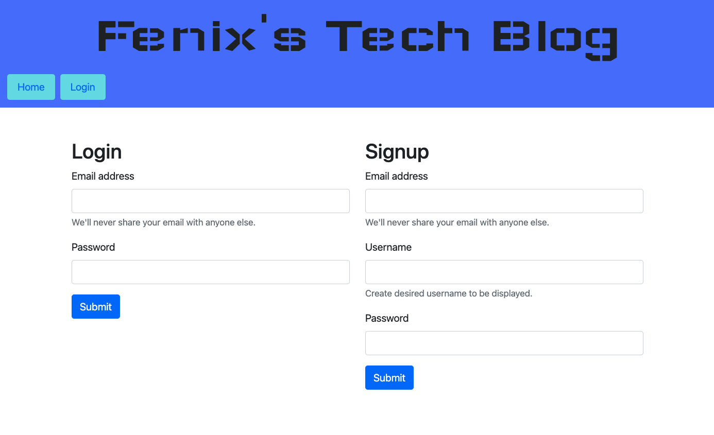
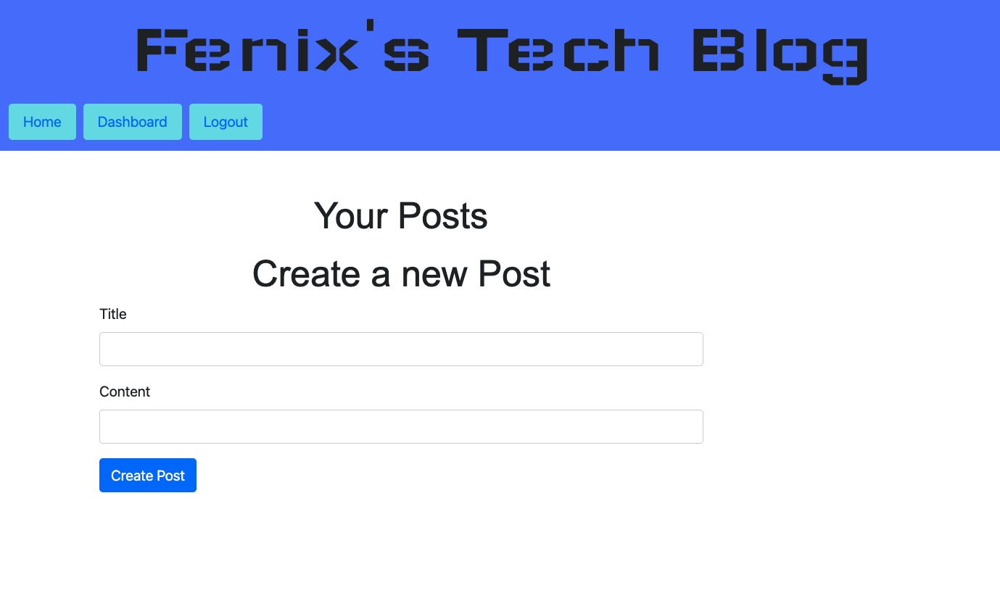
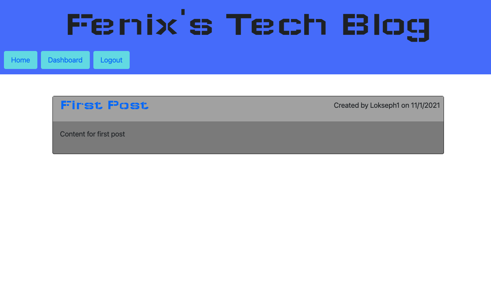
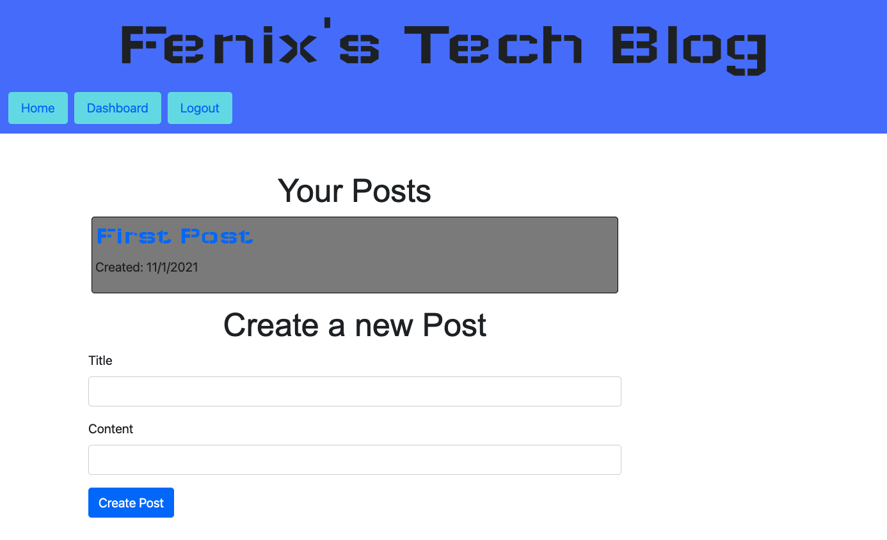
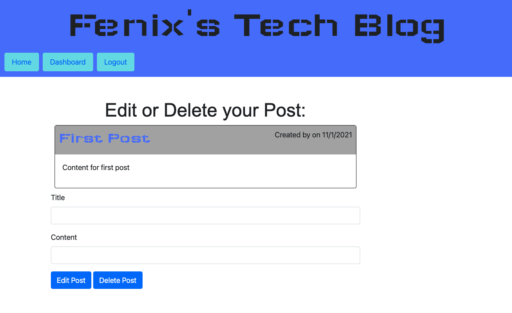

# MVC Tech Blog

  

  ## Description

  CMS-style blog site to create, view, edit and delete blog posts.
  
  ## Link to webpage
  
  Click the link below to visit my deployed page.
  <!-- [URL](undefined) -->
 https://fenix-sampson-tech-blog.herokuapp.com/

  ## Table of Contents
  
  * [Goals](#goals)

  * [Usage](#usage) 

  * [Installation](#installation)  

  * [Test](#test)

  * [Problems](#problems)

  * [Visualization](#visualization)

  * [Acknowledgements](#acknowledgements)

  * [Contributions](#contributions)

  * [Resources](#resources)

  * [License](#license) 

  * [Contact](#contact) 

  
  ## Goals

  Create a CMS-style blog site from scratch, where developers can publish their blog posts.

  ## Motivation

 Developers spend plenty of time creating new applications and debugging existing codebases, but most developers also spend at least some of their time reading and writing about technical concepts, recent advancements, and new technologies. 

  ## Usage

  This blog can be used to create, view, edit and delete posts.

  ## Installation
  
  npm install       followed by:  npm run       followed by: node server.js  

  ## Test

  N/A

  ## Problems

  The problems that I experienced from this project arose mostly from 1) the sheer number of files and 2) the deployment to Heroku.  I'm glad that I overcame these problems and learned from them in the process. 

  ## Visualization

  Login Page
  

  Create Post Page
  

  Home Page
  

  Dashboard Page
  

  Edit Post Page
  

  ## Acknowledgements

  Brent Graves and Gabriel Cavalcante Causin were instrumental in helping me figure out the issues that arose. 

  ## Contributions

  Email me or submit a pull request

  ## Resources
 
  -Handlebars
  -Bootstrap
  -Heroku
  -JawsDB
  -Express.js
  -Dotenv
  -Google Fonts

  ## License

  

  This projet uses MIT. 
  
  The link to the License can be found here (https://opensource.org/licenses/MIT)

  ## Contact
  
  GitHub Username: FenixS83 [@FenixS83](https://github.com/FenixS83)

  fenix.sampson@gmail.com

